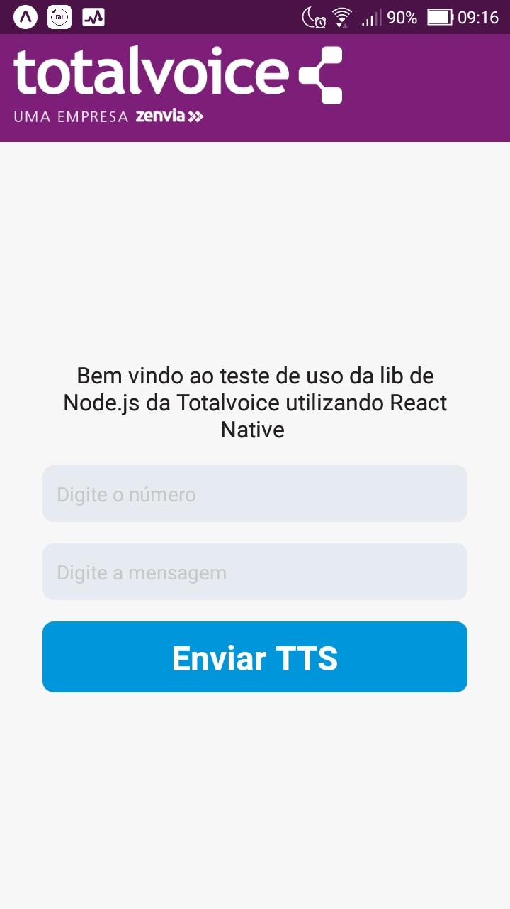

# utilizando-api-totalvoice-react-native
Projeto para exemplificar como utilizar a api da totalvoice em React Native

## Necessário ter os seguintes itens instalados:
- <a href="https://nodejs.org/en/">Node.js e npm</a>
- <a href="https://yarnpkg.com/lang/en/">Sugiro utilizar o Yarn</a>
- <a href="https://expo.io/learn">Instalar Expo globalmente</a>

## Iniciando projeto:

Abra o terminal no diretório do projeto e digite:

#### `npm install` ou `yarn`

Depois disso basta digitar no terminal:

#### `npm run start` ou `yarn start`

